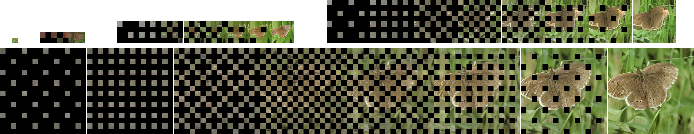
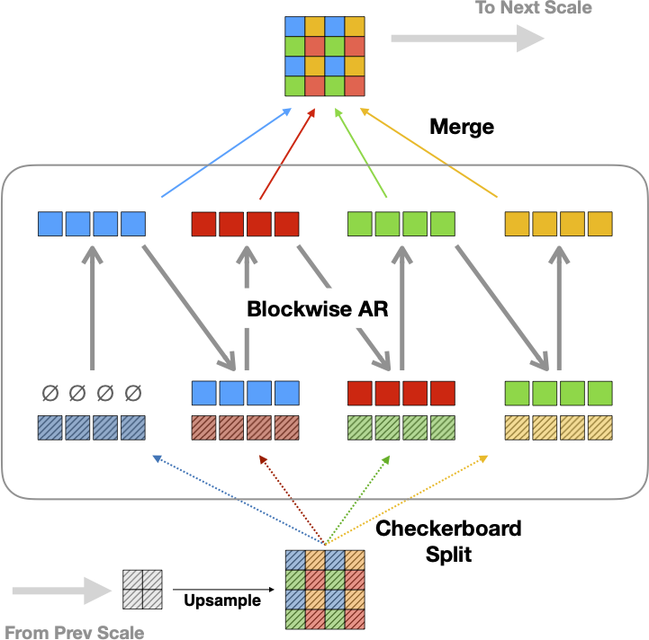

Progressive Checkerboards for Autoregressive Multiscale Image Generation
========================================================================

<!--
<div align="center">


</div>
-->


Code and pretrained models, as described in the paper:
[Progressive Checkerboards for Autoregressive Multiscale Image Generation](http://arxiv.org/abs/2602.03811).

This codebase is based on a combination of several prior codebases including:

  - [MAR](https://github.com/LTH14/mar)
  - [LlamaGen](https://github.com/FoundationVision/LlamaGen)
  - [PAR](https://github.com/YuqingWang1029/PAR)
  - [VAR](https://github.com/FoundationVision/VAR)
  - [LDM](https://github.com/CompVis/stable-diffusion)


## Download Pretrained Models

Pretrained models are available at the following links:


| Model              | Download Link                      |
|--------------------|------------------------------------|
| Autoencoder        | [link](https://drive.google.com/drive/folders/1GO5tmufbMX7h4Goy-6y0cd7Efm80m-2C) |
| Checkerboard-L-2x  | [link](https://drive.google.com/drive/folders/1B8G8Sg2hydqTITTGKRvHFDmwwam5ZT-V) |
| Checkerboard-L-4x  | [link](https://drive.google.com/drive/folders/1H-GEy9o4OcgHDUIG2XDVrh19r5k4znYK) |

To download and set up the pretrained models, create the following directories:

```bash
mkdir -p pretrained_models/autoencoder
mkdir -p pretrained_models/checkerboard-L-2x
mkdir -p pretrained_models/checkerboard-L-4x
```

Then download the config files and checkpoints from the links above into their respective directories.


## Generating Samples

To generate samples using the pretrained models, run the following command:

```bash
python main_sample.py --checkpoint pretrained_models/checkerboard-L-2x/checkpoint-last.pth --cfg 1.5 --steps_per_scale 4
```

## Training Models

To train a new model, use the following command:

```bash
python main.py --config configs/config_256_S.yaml
```

This assumes you have imagenet downloaded and linked to `data/imagenet`.
Adjust the config file as needed for different datasets or model configurations.

### Training Data Cache

To speed up training, you can create a cached version of the training data, using

```bash
python main.py --config configs/config_256_S.yaml --create_cache --batch_size 32
```

and then use it with the `--use_cache` flag during training.

This creates a cache with all of the scales used for experiments in the paper.  To
only cache scales used in one model config, see the code in main.py.


## Evaluation

There are two evaluation methods used in this repo.

torch_fidelity is used for inline evlauations during training.

For final evaluations, we use the original tensorflow implementations, which
produce slightly different numbers, but are more comparable to prior work.
These are in evaluator.py and run_evaluator.sh.  The reference set used for
these evals is at [reference set](https://openaipublic.blob.core.windows.net/diffusion/jul-2021/ref_batches/imagenet/256/VIRTUAL_imagenet256_labeled.npz).


## Autoencoder Requantization

The autoencoder used in this work is a requantized version of the LlamaGen autoencoder.
The requantization code is in `train_ae_codebook/`.  The code here is somewhat complex
for what it does, but included for completeness.  This code retrains just the quantization
layer as described in our paper, using the pretrained weights from LlamaGen
[link](https://huggingface.co/FoundationVision/LlamaGen/resolve/main/vq_ds16_c2i.pt) [page](https://github.com/FoundationVision/LlamaGen/?tab=readme-ov-file#-class-conditional-image-generation-on-imagenet).


## Errata

- We use the standard reference set for FID evals, not the full ImageNet validation set as mentioned in the paper (v1).


## Citation

If you find this code useful for your research, please consider citing the following paper:

```
@article{progcheck2026,
  title={Progressive Checkerboards for Autoregressive Multiscale Image Generation},
  author={David Eigen},
  journal={arXiv preprint arXiv:2602.03811},
  year={2026}
}
```
